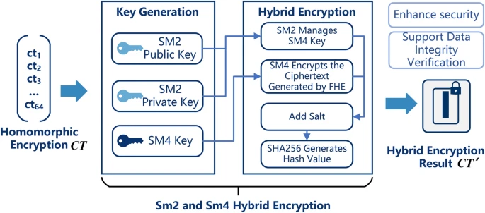

Page de l'article : [cliquer ici](https://link.springer.com/article/10.1038/s41598-025-95383-2#Sec10)

# 📄 Résumé de l'article : _Fully Homomorphic Encryption for Privacy-Preserving Face Recognition_

L'article explore l'utilisation du **chiffrement homomorphe totalement (FHE)** dans la reconnaissance faciale en préservant la confidentialité des données. Cette approche permet de traiter des données personnelles (comme des caractéristiques faciales) sans les exposer pendant le traitement, tout en préservant la sécurité.

## 🔐 Chiffrement Homomorphe Total (FHE)

Le **FHE** permet de réaliser des calculs sur des données chiffrées sans avoir à les déchiffrer. Cette propriété est essentielle pour la protection des données personnelles dans des applications comme la reconnaissance faciale, où les données sensibles ne doivent pas être accessibles pendant les processus d'analyse.

## 📊 Méthodologie de Traitement des Données

### 1. **Prétraitement des Données**

-   Les caractéristiques faciales sont extraites d'images via des techniques comme **ISOMAP**, une méthode de réduction de la dimensionnalité.
-   Ces caractéristiques extraites sont ensuite représentées sous forme de vecteurs, dont la dimension est réduite par ISOMAP

### 2. **Chiffrement des Données**

-   Une fois les données prétraitées, elles sont **chiffrées** à l'aide du FHE avant tout calcul. Cela garantit que même si les données sont traitées sur des serveurs distants, elles restent protégées et invisibles.

### 3 **Envoie des données**

-   Utilisation de SM2 pour crypter SM4 et utilisation de SM4 pour crypter les données précédentes.
-   Le texte SM4 (altéré par des résidut au cours du chiffrement pour generer des haché uniques et vérifier l'intégrité) et la clé chiffré SM2 sont transmises

### 4. **Calcul sur Données Chiffrées**

-   Les opérations nécessaires pour la reconnaissance faciale, comme la comparaison de vecteurs de caractéristiques (par exemple, le calcul de la distance Euclidienne ou de produits scalaires), sont effectuées directement sur les données **chiffrées**.
-   Aucun des serveurs n'a accès aux données en clair, ce qui préserve la confidentialité.

### 5. **Déchiffrement et Résultats**

-   Après avoir effectué les calculs sur les données chiffrées, les résultats sont déchiffrés (si nécessaire) pour être utilisés par l'utilisateur final.
-   Le processus de déchiffrement garantit que seules les personnes autorisées peuvent accéder aux résultats finaux, tout en maintenant la confidentialité tout au long du processus.

## 🚀 Applications et Avantages

L'application de **FHE** dans la reconnaissance faciale permet une meilleure **protection de la vie privée**. Les utilisateurs peuvent interagir avec des systèmes de reconnaissance faciale tout en s'assurant que leurs données personnelles ne sont jamais exposées pendant le traitement. Cela ouvre de nouvelles possibilités pour des applications sensibles où la confidentialité est une priorité, comme dans les services bancaires ou de sécurité.

## ⚠️ Défis et Limites

Malgré ses avantages en matière de confidentialité, le FHE souffre de **performances faibles** et d'un **fort coût en calcul** et en mémoire. Ces limitations rendent son utilisation dans des systèmes de grande envergure difficile à l'heure actuelle. Cependant, les progrès en matière de **optimisation des algorithmes** et de **réduction de la consommation de ressources** pourraient rendre cette technologie plus viable à l'avenir.

## 🔧 Bibliothèques et Frameworks

-   **SEAL** (Microsoft)
-   **HElib** (IBM)
-   **OpenFHE** (Duality)
-   **Concrete** (Duality)

Ces bibliothèques FHE open-source facilitent l'implémentation de solutions basées sur le chiffrement homomorphe, avec des outils adaptés pour le développement de modèles et d'applications sécurisées.

---

_Source : Article "Fully Homomorphic Encryption for Privacy-Preserving Face Recognition"_

FHE chiffrement publique et symétrique

extraction de features
reduction de dimension
FHE sur les données
